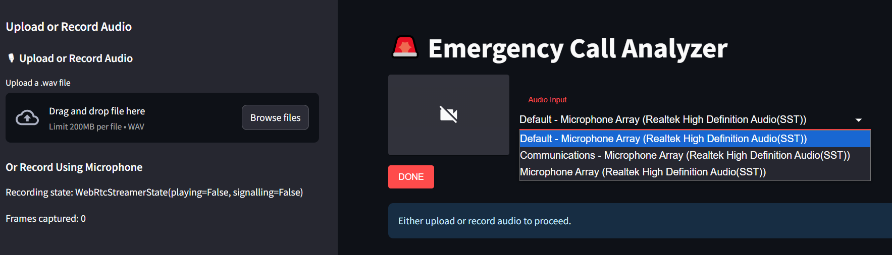
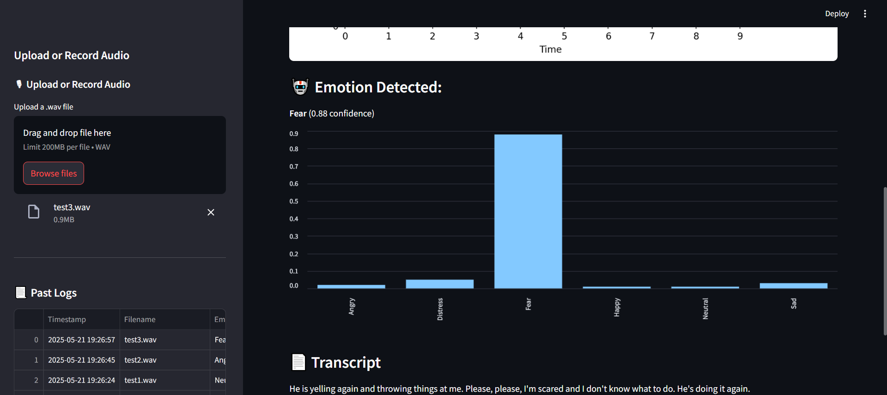
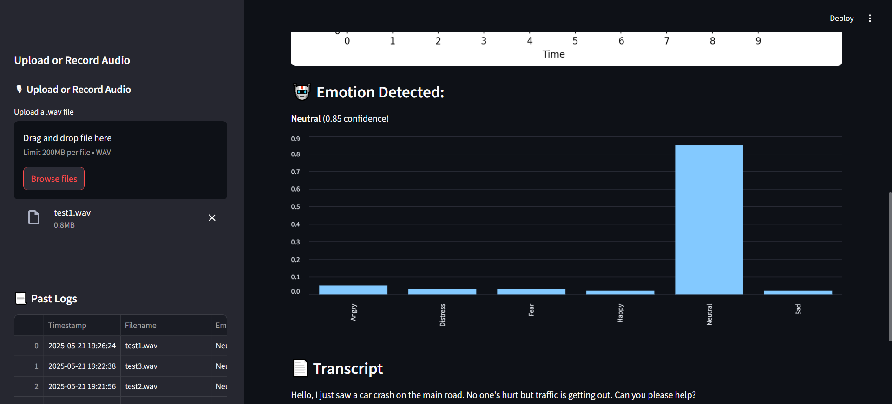
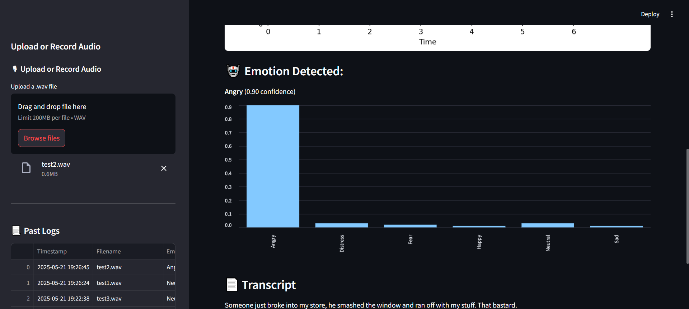
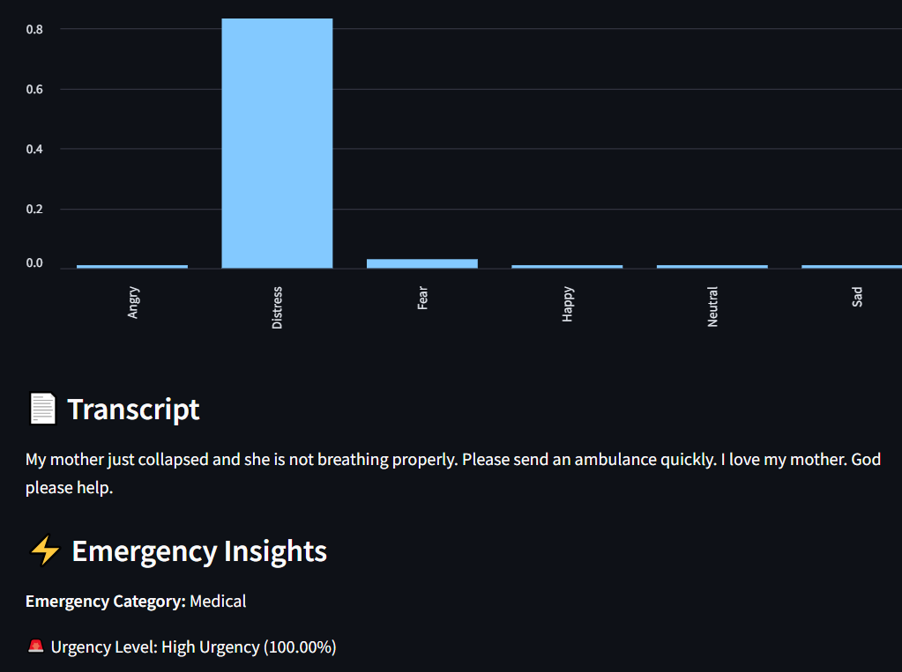
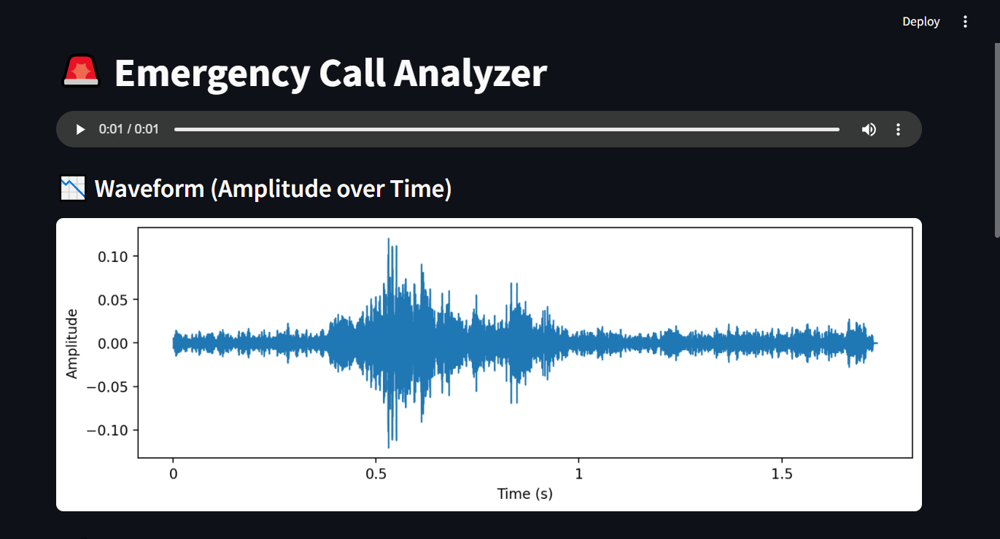
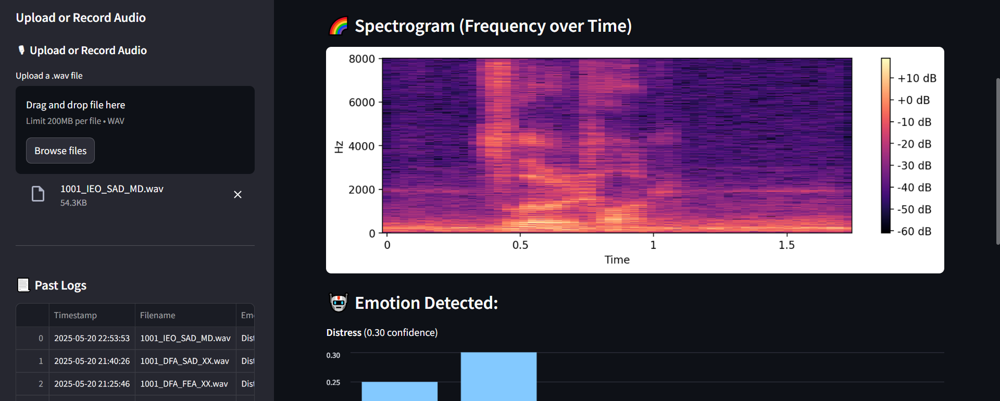
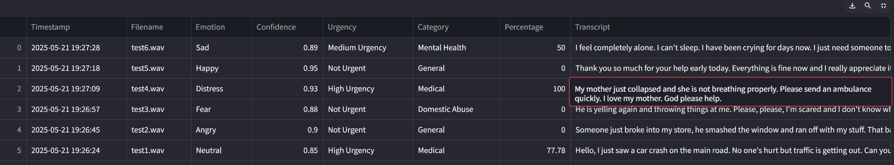

# 🚨 Emergency Call Analyzer

**A real-time voice analysis dashboard for emergency response systems**

This tool captures and analyzes audio from distress/emergency calls, classifies the speaker's **emotional state**, detects **urgency categories**, transcribes **speech to text**, and identifies potential emergency types — all within a unified and intuitive interface.

---

## 🔍 Features

- 🎙️ **Audio Input**  
  Record voice via microphone or upload `.wav` audio files.

- 📊 **Audio Visualization**  
  Real-time waveform and frequency plots — like those seen in control rooms.

- 🤖 **Emotion Detection**  
  Deep learning-based emotion classifier trained on extracted audio features.

- 🔈 **Speech Transcription**  
  Converts speech to text using automatic speech recognition (ASR).

- 🚨 **Emergency Categorization**  
  Classifies the call into:  
  `Medical`, `Crime`, `Fire`, `Domestic Abuse`, `Accident`, or `Mental Health`  
  based on keywords found in the transcript.

- 📈 **Visual Dashboard**  
  Bar chart visualizations of emotion probabilities with urgency summary.

- 📝 **Logging System**  
  Keeps a structured log of all test/demo calls for quick reference and audits.

---

## 🧠 Model Overview

This project employs a hybrid deep learning architecture that combines **CNNs** for spatial feature extraction with **LSTM layers** for temporal modeling. It is purpose-built for emotion recognition from variable-length audio signals, especially under real-time, noisy, or low-resource conditions.

### 🔍 Key Features
- **Multi-channel feature fusion** across acoustic, spectral, and statistical domains
- **Temporal state modeling** using bidirectional LSTM layers
- Optimized for **emotion detection in emergency call scenarios**

---

## 🏗 Model Architecture Summary

> **Input:** `(T, F, 5)` feature tensor  
> `T` = time steps, `F` = feature dimension, `5` = number of feature channels

**Pipeline:**

### 🔧 Core Components

| Component         | Configuration                            |
|------------------|------------------------------------------|
| **Input Shape**   | (Time, Frequency, Channels)              |
| **CNN Layers**    | 2–4 Conv2D layers (3×3 kernel)           |
| **Pooling**       | MaxPooling2D (2×2)                       |
| **Normalization** | BatchNorm after each Conv layer         |
| **LSTM Layers**   | 1–2 BiLSTM (128–256 units)               |
| **Dense Layers**  | 1–2 layers with ReLU + Dropout           |
| **Output Layer**  | Softmax over emotion categories          |
| **Optimizer**     | Adam or RMSprop                          |
| **Loss Function** | Categorical Cross-Entropy                |

---

## 📊 Multi-Channel Audio Feature Stack

The model operates on stacked multi-view audio features, enriching emotional context through complementary representations.

| Channel | Feature Type       | Description                                      |
|---------|--------------------|--------------------------------------------------|
| 1       | **MFCCs**          | Captures the spectral envelope of audio         |
| 2       | **Chroma STFT**    | Harmonic energy mapped to pitch classes         |
| 3       | **Spectral Contrast** | Tonal peak–valley contrast across sub-bands |
| 4       | **LLDs (OpenSMILE)** | Energy, pitch, jitter, shimmer, etc.         |
| 5       | **Mel-Spectrogram**  | Time-frequency map with log-scaled energy    |

> These are preprocessed and stacked into a `(T, F, 5)` tensor per audio sample.

---

## 🎯 Emotion Recognition Targets

The model is trained to recognize the following emotional states:

- 😐 Neutral  
- 😠 Angry  
- 😨 Fear  
- 😫 Distress  
- 🙂 Happy  
- 😢 Sad

### Output:
- Predicted **emotion label**
- **Confidence score**
- Full **emotion probability distribution** (for visualization)

---

## 📦 Installation & Running Locally

### 1️⃣ Clone the repository

```bash
git clone https://github.com/yourusername/emergency-call-analyzer.git
cd emergency-call-analyzer
```

### 2️⃣ Install the dependencies

```bash
pip install -r requirements.txt
```

3️⃣ Run the Streamlit app
```bash
python -m streamlit run app.py
```

🪟 On Windows and facing FFmpeg issues?
Run the following to use the bundled version automatically:

```bash
python setup_ffmpeg.py
```


## 🖼️ Project Screenshots

### 🎛️ Home - Audio Input  


### 📈 Emotion - Detection  




### 📋 Transcription and Categorization  


### 📋 Waveform Visualisation  


### 📋 Spectogram Visualisation


### 📋 Call Logs For Record



## 🎯 Use Case

This project is tailored for:

- Emergency service control rooms (e.g., 112/911 centers)
- Mental health helplines
- Voice surveillance in smart city frameworks
- Field testing and research in crisis communication

By identifying emotional distress and matching context to predefined urgency categories, responders are better equipped to prioritize calls effectively.

---

## 🚀 Features

- 🎤 Audio Upload & Recording  
- 🧠 Real-time Emotion Detection  
- 🗣️ Automatic Speech Transcription  
- 🏷️ Keyword-based Urgency Categorization  
- 📊 Visualized Emotion Probabilities  
- 📁 Simple UI built using [Streamlit](https://streamlit.io)

---

## ⚙️ Tech Stack

- **Voice Feature Extraction**: `librosa`, `pydub`  
- **Transcription**: OpenAI Whisper / `SpeechRecognition`  
- **Emotion Model**: Custom-trained deep learning model  
- **UI/UX**: `Streamlit`  
- **Audio Handling**: Optional FFmpeg setup for Windows (`setup_ffmpeg.py`)

---

## 🤝 Contributing

Pull requests are welcome! Feel free to fork the repo and submit improvements or suggestions via PRs.

---

📢 _If you use or extend this project, consider ⭐ starring the repository!_
